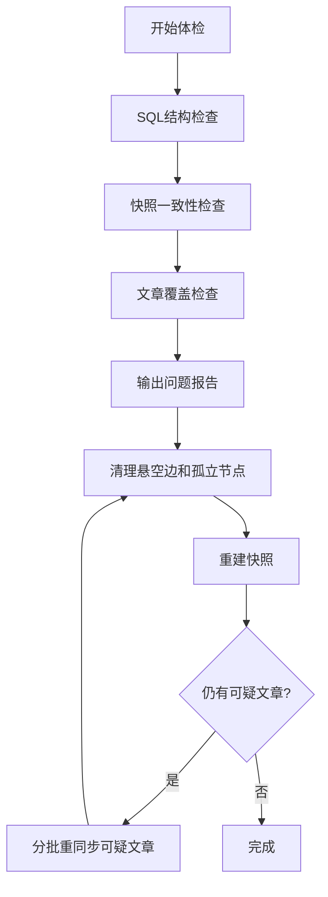

# 图谱完整性验证与低成本修复方案

## 背景判断
当前问题很可能来自之前同步任务在 `_cleanup_orphan_nodes()` 阶段失败，导致部分文章已经写入 DB，但最后的孤立节点清理和 `current_snapshot.json` 重建没有成功。因此前端/问答读取的快照可能落后于数据库，或者数据库中残留噪声节点。

关键路径在：
- [backend/app/services/knowledge_graph/service.py](backend/app/services/knowledge_graph/service.py)：`sync_articles()`、`_cleanup_orphan_nodes()`、`rebuild_snapshot()`、`_needs_sync()`、`_sync_single_article()`
- [backend/app/db/models.py](backend/app/db/models.py)：`KnowledgeGraphNode`、`KnowledgeGraphEdge`、`KnowledgeGraphArticleState`、`KnowledgeGraphBuild`
- [backend/app/api/v1/endpoints/knowledge_graph.py](backend/app/api/v1/endpoints/knowledge_graph.py)：现有 `/sync` 入口

## 方案核心
采用三档处理，按成本从低到高执行：

1. 只读体检：不调用 AI、不重建文章，只检查结构问题。
   - 统计节点、边、文章状态、最近失败 build。
   - 检查悬空边：边引用的 source/target 节点不存在。
   - 检查孤立节点：节点没有任何入边/出边。
   - 检查快照内部：`links.source/target` 是否都存在于 `nodes.node_key`。
   - 检查快照与 DB：节点数、边数、生成时间、build id 是否明显不一致。
   - 检查已同步文章覆盖：`status='synced'` 的文章是否有 `article:{id}` 节点、是否有 `source_article_id=id` 的边。

2. 低成本修复：只修结构和快照，不重跑每篇文章。
   - 删除悬空边。
   - 用子查询清理孤立节点，避免再次触发 SQLite `too many SQL variables`。
   - 删除对应文章已不存在的 article_state。
   - 调用 `rebuild_snapshot()` 从 DB 重新生成快照。
   - 这一步通常能修复“DB 有数据但图谱/问答看不到”的问题。

3. 精准重同步：只重跑异常文章。
   - 找出可疑 article ids：`error/pending`、`content_hash` 为空、`updated_at > last_synced_at`、缺少 `article:{id}` 节点、缺少 `source_article_id=id` 边、或者用户指定关键词命中的文章。
   - 分批调用现有 `sync_articles(article_ids=[...], force_rebuild=False)`。
   - 每篇文章同步时已有 `_replace_article_edges(article.id)`，会替换该文章旧边，并 upsert 节点。
   - 批量结束后再清理孤儿节点并重建快照。

## 推荐实现
新增一个“维护层”而不是改动正常同步主流程：

- 在 [backend/app/services/knowledge_graph/service.py](backend/app/services/knowledge_graph/service.py) 增加：
  - `diagnose_integrity()`：返回体检报告和 suspect article ids。
  - `repair_integrity(dry_run=True, resync=False, article_limit=100)`：默认 dry-run；确认后执行清理、快照重建、可选精准重同步。
- 在 [backend/app/schemas/knowledge_graph.py](backend/app/schemas/knowledge_graph.py) 增加诊断/修复响应模型。
- 在 [backend/app/api/v1/endpoints/knowledge_graph.py](backend/app/api/v1/endpoints/knowledge_graph.py) 增加维护接口：
  - `GET /knowledge-graph/integrity`：只读体检。
  - `POST /knowledge-graph/integrity/repair`：默认 dry-run，支持 `repair_snapshot`、`cleanup_orphans`、`resync_suspects`、`keyword`、`limit`。

## 执行流程

## 针对 GPT-5.5 的验证
体检接口支持 `keyword=gpt5.5` / `gpt-5.5` 这类关键词：
- 先查文章表是否存在相关内容。
- 如果文章存在但没有对应 `article:{id}` 节点或边，则列入 suspect articles。
- 如果文章不存在，则不是图谱损坏，而是采集源没有收录相关内容。
- 如果 DB 图谱存在但快照没有，则只需重建快照，不需要重跑 AI 抽取。

## 测试计划
- 扩展 [backend/tests/test_knowledge_graph_service.py](backend/tests/test_knowledge_graph_service.py)：覆盖孤立节点、悬空边、快照落后、缺失 article 节点、只重同步 suspect articles。
- 扩展 [backend/tests/test_knowledge_graph_api.py](backend/tests/test_knowledge_graph_api.py)：覆盖 integrity 只读报告和 dry-run repair。
- 保留现有 `_cleanup_orphan_nodes` 子查询测试，防止 `too many SQL variables` 回归。

## 默认策略
默认先做 `GET /integrity` 和 `POST /integrity/repair` 的 dry-run，不实际改数据。确认报告后，优先执行“清理 + 快照重建”；只有报告显示某些文章确实缺节点/缺边时，再对这些 article ids 精准重同步。