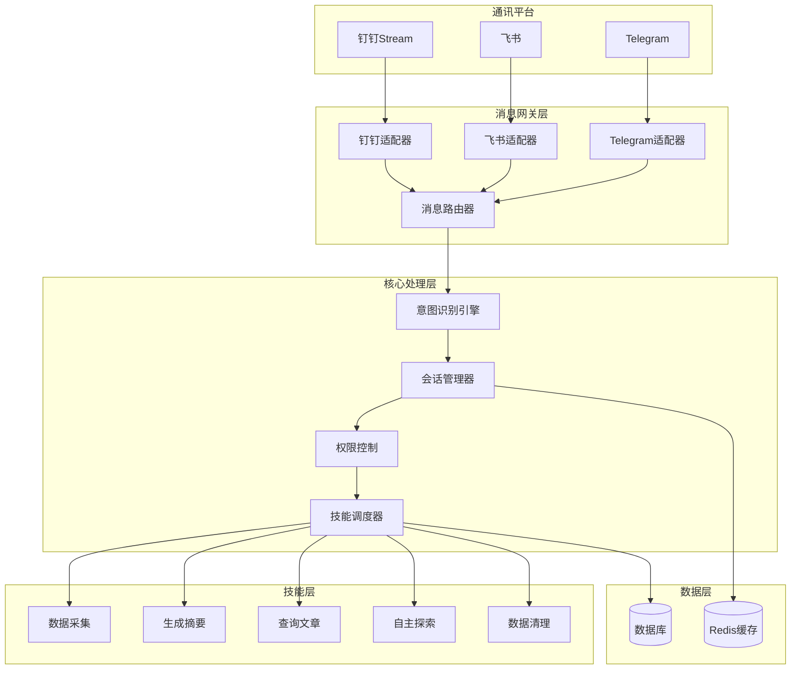
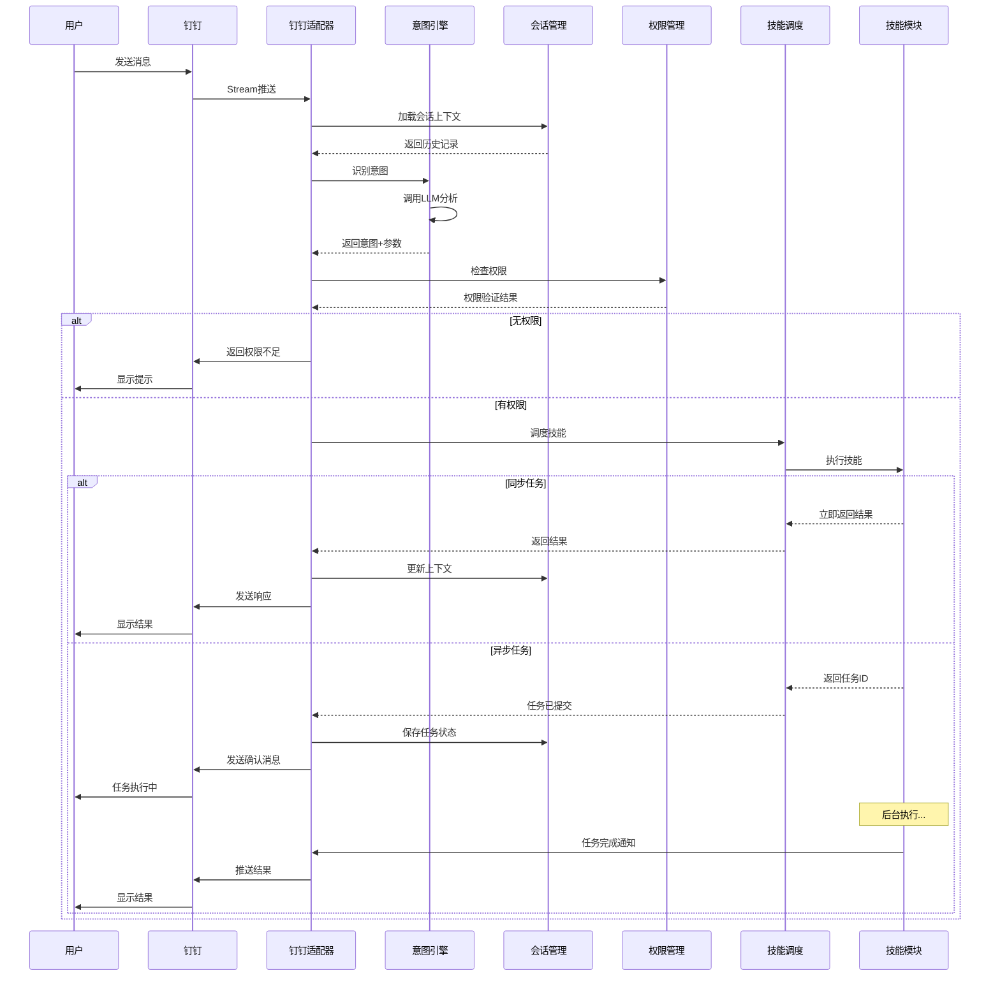

# 通讯软件智能网关系统设计方案

## 整体架构

采用**分层架构 + 适配器模式**，实现统一的消息处理流程和可扩展的平台接入：




## 核心模块设计

### 1. 消息网关服务 (`services/chatbot_gateway/`)

**目录结构**：

```
services/chatbot_gateway/
├── __init__.py
├── gateway_service.py          # 网关主服务
├── adapters/                    # 平台适配器
│   ├── __init__.py
│   ├── base_adapter.py         # 抽象基类
│   ├── dingtalk_adapter.py     # 钉钉适配器
│   ├── feishu_adapter.py       # 飞书适配器（待实现）
│   └── telegram_adapter.py     # Telegram适配器（待实现）
├── intent_engine.py            # 意图识别引擎
├── session_manager.py          # 会话管理器
├── permission_manager.py       # 权限管理器
└── skill_dispatcher.py         # 技能调度器
```

### 2. 平台适配器（钉钉 - 第一期）

**钉钉Stream适配器**实现：

- 使用 `dingtalk-stream` SDK
- 继承 `ChatbotHandler` 处理消息
- 统一消息格式转换
- 支持文本、Markdown、ActionCard等消息类型
- 自动处理连接重试和异常

**关键代码位置**：`services/chatbot_gateway/adapters/dingtalk_adapter.py`

```python
from dingtalk_stream import ChatbotHandler
import dingtalk_stream

class DingTalkAdapter(ChatbotHandler):
    async def process(self, callback: ChatbotMessage):
        # 1. 提取消息内容和用户信息
        # 2. 转换为统一消息格式
        # 3. 调用网关处理
        # 4. 格式化响应并回复
```

### 3. 意图识别引擎（LLM-based）

**工作流程**：

1. 接收用户消息文本
2. 加载历史会话上下文（最近N轮对话）
3. 构建提示词，调用LLM识别意图
4. 解析返回的结构化意图（JSON格式）
5. 返回：`{intent: "collection", params: {...}, confidence: 0.95}`

**支持的意图类型**：

- `collection` - 触发数据采集
- `summary` - 生成摘要
- `query` - 查询文章/统计
- `exploration` - 执行探索任务
- `cleanup` - 数据清理
- `help` - 帮助信息
- `chat` - 闲聊（默认）

**关键代码位置**：`services/chatbot_gateway/intent_engine.py`

### 4. 会话管理器

**功能**：

- 存储用户会话上下文（Redis）
- 支持多轮对话记忆
- 会话超时自动清理（默认30分钟）
- 记录任务执行状态

**数据结构**：

```python
{
    "session_id": "dingtalk_user123",
    "user_id": "user123",
    "platform": "dingtalk",
    "context": [
        {"role": "user", "content": "帮我采集最新数据"},
        {"role": "assistant", "content": "好的，正在采集..."}
    ],
    "current_task": {
        "task_id": "task_abc",
        "status": "running",
        "created_at": "2026-02-09T10:00:00"
    },
    "created_at": "2026-02-09T10:00:00",
    "last_active": "2026-02-09T10:05:00"
}
```

**关键代码位置**：`services/chatbot_gateway/session_manager.py`

### 5. 权限管理器（基于角色）

**角色定义**：

- `admin` - 管理员，所有权限
- `operator` - 操作员，执行采集、清理等操作
- `viewer` - 查看者，仅查询权限
- `guest` - 访客，仅帮助和基础查询

**权限配置表**（新增数据库表）：

```python
class ChatbotUser(Base):
    __tablename__ = "chatbot_users"
    
    id = Column(Integer, primary_key=True)
    platform = Column(String(50))  # dingtalk/feishu/telegram
    platform_user_id = Column(String(200))  # 平台用户ID
    username = Column(String(200))
    role = Column(String(50), default="guest")
    enabled = Column(Boolean, default=True)
    extra_config = Column(JSON)  # 额外配置
    created_at = Column(DateTime, default=datetime.now)
```

**关键代码位置**：`services/chatbot_gateway/permission_manager.py`

### 6. 技能调度器

**功能**：

- 根据意图调度相应技能
- 同步任务直接执行返回结果
- 异步任务提交到APScheduler，返回任务ID
- 复用现有 `skills/` 目录的技能代码

**技能映射表**：

```python
SKILL_REGISTRY = {
    "collection": {
        "handler": "execute_collection",
        "async": True,
        "permissions": ["admin", "operator"]
    },
    "summary": {
        "handler": "execute_summary",
        "async": True,
        "permissions": ["admin", "operator"]
    },
    "query": {
        "handler": "execute_query",
        "async": False,
        "permissions": ["admin", "operator", "viewer"]
    },
    "exploration": {
        "handler": "execute_exploration",
        "async": True,
        "permissions": ["admin"]
    },
    "cleanup": {
        "handler": "execute_cleanup",
        "async": True,
        "permissions": ["admin"]
    }
}
```

**关键代码位置**：`services/chatbot_gateway/skill_dispatcher.py`

### 7. 数据库模型扩展

新增表：

- `chatbot_users` - 用户权限管理
- `chatbot_conversations` - 会话记录（可选，用于审计）
- `chatbot_tasks` - 任务执行记录

**关键代码位置**：`db/models.py`（扩展）

### 8. API端点

新增路由：`/api/v1/chatbot`

**端点列表**：

- `GET /chatbot/users` - 获取用户列表
- `POST /chatbot/users` - 添加用户
- `PUT /chatbot/users/{id}` - 更新用户权限
- `DELETE /chatbot/users/{id}` - 删除用户
- `GET /chatbot/status` - 获取网关状态
- `POST /chatbot/start` - 启动钉钉机器人
- `POST /chatbot/stop` - 停止钉钉机器人

**关键代码位置**：`api/v1/endpoints/chatbot.py`

### 9. 配置管理

扩展 `AppSettings` 表，新增配置项：

```python
# 钉钉Stream配置
DINGTALK_CLIENT_ID: str = ""
DINGTALK_CLIENT_SECRET: str = ""
DINGTALK_BOT_ENABLED: bool = False

# 会话配置
SESSION_TIMEOUT_MINUTES: int = 30
MAX_CONTEXT_TURNS: int = 10

# 意图识别配置
INTENT_MODEL: str = "gpt-4"  # 复用现有LLM配置
INTENT_CONFIDENCE_THRESHOLD: float = 0.7
```

**关键代码位置**：`core/settings.py`（扩展）

## 消息处理流程




## 技术选型

### 依赖库

- `dingtalk-stream` - 钉钉Stream SDK
- `redis` - 会话存储（可选，不可用时降级为内存）
- 复用现有：`openai`、`APScheduler`、`SQLAlchemy`

### 配置说明

- 钉钉机器人作为独立的后台服务运行
- 与FastAPI应用共享数据库和配置
- 支持独立启动/停止

## 扩展性设计

### 新增平台适配器（飞书/Telegram）

1. 继承 `BaseAdapter` 抽象类
2. 实现 `send_message`、`format_response` 等方法
3. 在 `gateway_service.py` 中注册适配器
4. 添加对应配置项

### 新增技能

1. 在 `skills/` 目录创建技能模块
2. 在 `SKILL_REGISTRY` 注册技能
3. 在意图引擎提示词中添加意图描述

## 安全考虑

1. **身份验证**：验证钉钉消息签名（Stream模式自动处理）
2. **权限控制**：基于角色的访问控制（RBAC）
3. **速率限制**：防止滥用（可选，使用Redis计数器）
4. **敏感信息**：不在聊天中返回API密钥等敏感配置
5. **日志审计**：记录所有命令执行日志

